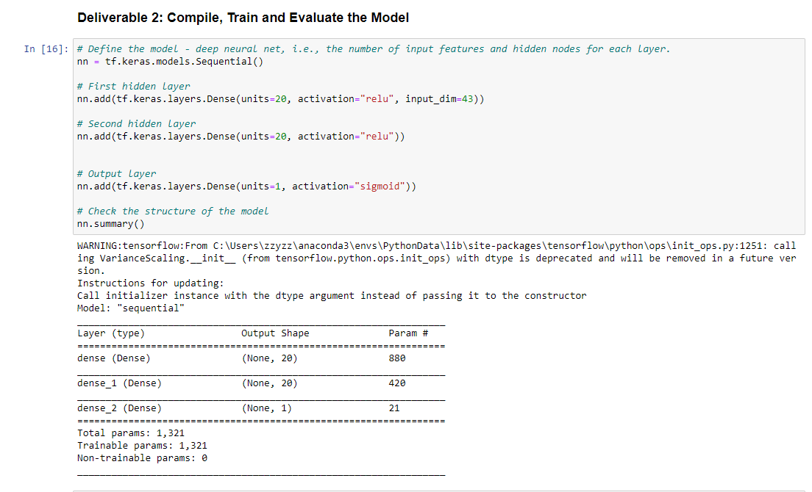
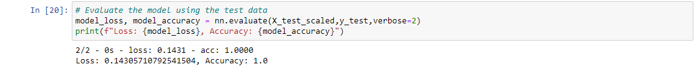

# Neural_Network_Charity_Analysis

## Overview of the Analysis

Based on historical funding data from more than 34,000 organizations, my goal is to create a binary classifier that is capable of predicting whether applicants will be successful if funded by Alphabet Soup.

## Results

### Data preprocessing

- The target variable for this model is the column "IS_SUCCESSFUL", which represents whether the charity that received funding was succesful afterwards. 

- The following variables were considered to be features of the model: 'APPLICATION_TYPE', 'AFFILIATION','CLASSIFICATION','USE_CASE','ORGANIZATION','INCOME_AMT'and 'SPECIAL_CONSIDERATIONS'

- The following variables were neither target or feature variables and should be removed: 'EIN', 'NAME', 'STATUS'and 'ASK_AMT'

### Compiling, Training and Evaluating the Model

- As seen the in the image below, the optimized model contained two layers of 20 neurons each, not including the output layer with 1 neuron. Both layers used the RELU activation function, with the output being the sigmoid function.

- As seen in the image below, I was able to achieve the target model performance, and had a 100% accuracy. 

- The only step that I needed to increase my model performance was increase the number of neurons in each layer. My initial number of neurons in each layer used was 10 and I increased it to 20. 

## Summary

Overall, the deep learning model was able to achieve a 100% accuracy in determining whether a grantee will be successful in the future, based on many features as mentionned above. 

Due to the nature of the data, we could also use a unsupervised machine learning model in order to solve the classification issue. This is because we do not know what features will impact the classification, therefore we should not predict which model to use. However with an unsupervised model, the model itself can determine how to cluster the input data and give more optimal results.
